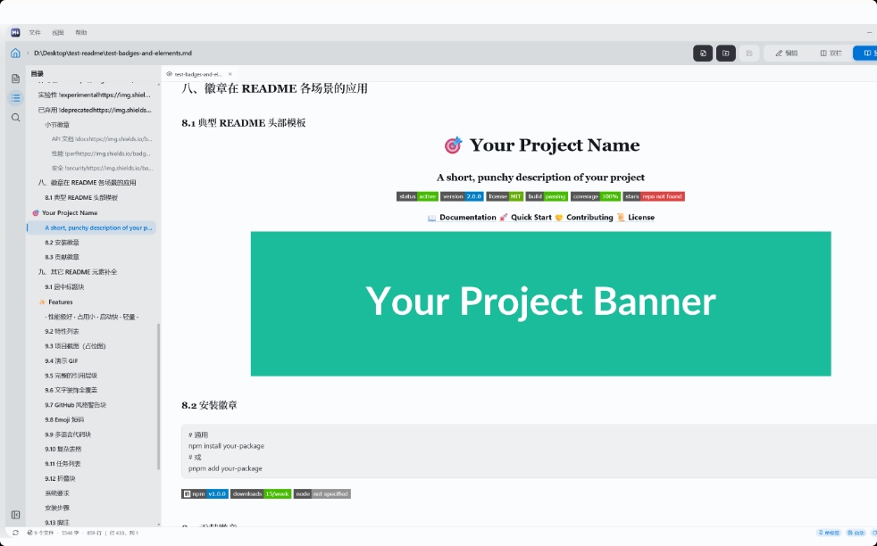
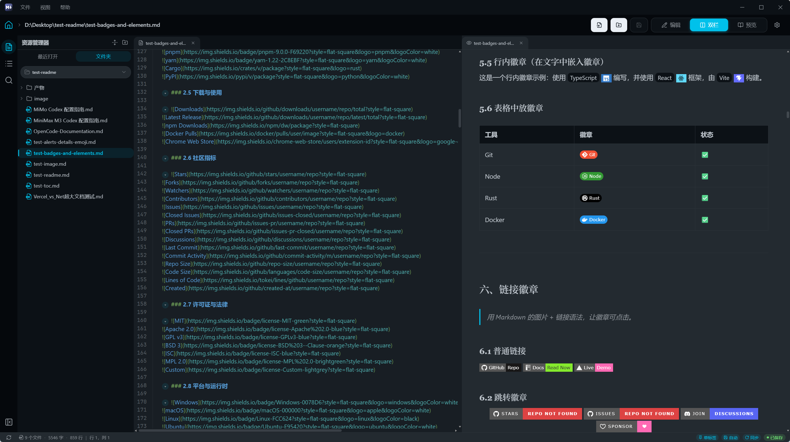
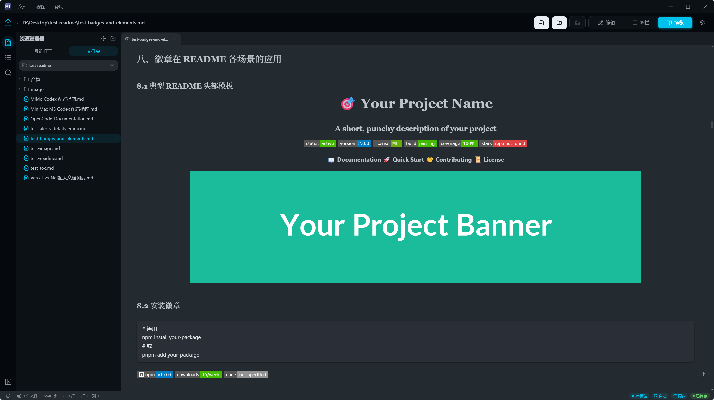

# MarkLite


> A lightweight, instant-launching cross-platform Markdown editor. Built with Tauri 2 + React 19 + CodeMirror 6.

English · [中文](./README.md)

---

## Preview

<p align="center" style="margin: 40px 0;">
  
</p>

<p align="center" style="margin: 32px 0 48px 0;">
  
  
</p>

---

## Features

### ✍️ Editing
- Supports `.md` / `.markdown` / `.mdx` formats
- **Three layout modes**: Editor-only, Split (default), Preview-only — toggle with `Ctrl+L`
- **Multi-tab**: Edge-style adaptive tabs with auto-shrink and dirty-state indicators
- **Document outline**: Extracts headings from Markdown source, click to jump
- **Word count**: Mixed Chinese/English counting, displayed in the status bar
- **Line numbers / Word wrap / Tab size**: All configurable
- **Ctrl+Click links**: Open URLs directly inside the editor
- **Find & Replace**: Built-in CodeMirror search panel (`Ctrl+F`)

### 🎨 Appearance
- **8 color schemes**: Violet / Paper / Amber / Midnight / Ember / Notion / GitHub / Ink
- **System follow**: Auto-matches system light/dark preference
- **Adjustable font size & family**: 9 monospace fonts including JetBrains Mono, Fira Code, Maple Mono
- **Theme-driven styling**: Single `data-scheme` attribute drives all CSS variables — editor, preview, and components stay in sync

### 📂 File Management
- **Open folder**: Browse file tree, expand/collapse directories
- **Recent files**: Pin favorites, clear history in one click
- **Full-text search**: Search across all Markdown files in a folder
- **File rename**: Right-click → inline edit
- **Multi-folder workspace**: Manage multiple directories simultaneously
- **Auto-save**: Debounced writes to disk with configurable delay
- **Auto-refresh**: Sync file changes from disk at configurable intervals
- **Session restore**: Automatically reopens the last edited file on startup

### 🔄 Preview
- **Live preview**: marked parsing → Shiki syntax highlighting → DOMPurify sanitization
- **Scroll sync**: Bidirectional editor ↔ preview scrolling with 60ms anti-loop lock
- **Code block copy**: Hover to reveal copy button on code blocks
- **Footnote support**: via marked-footnote plugin
- **Link navigation**: Relative Markdown links open in-editor; external links open in system browser

### 🖥️ Interface
- **Custom title bar**: Brand logo + menu bar (File / View / Themes) + window controls
- **Top bar**: Breadcrumb path + layout switcher + sidebar toggle + settings button
- **Status bar**: Cursor position / word count / file status / refresh button
- **Resizable split view**: Drag to adjust ratio, double-click to reset
- **Resizable sidebar**: Activity bar + panel layout
- **Keyboard shortcuts**: `Ctrl+Shift+H` opens the shortcuts help panel

---

## Color Schemes

| Scheme | Mode | Preview Background |
|:---|:---:|:---|
| Violet | ☀️ Light | `#eef0f7` |
| Paper | ☀️ Light | `#faf9f6` |
| Amber | ☀️ Light | `#f8f5ef` |
| Notion | ☀️ Light | `#ffffff` |
| GitHub | ☀️ Light | `#f6f8fa` |
| Midnight | 🌙 Dark | `#1b1f27` |
| Ember | 🌙 Dark | `#241e18` |
| Ink | 🌙 Dark | `#1a1a1a` |

---

## Tech Stack

| Category | Choice |
|---|---|
| Desktop Framework | Tauri 2 (Rust) — minimal shell with 5 plugins, no business commands |
| Frontend | React 19 + TypeScript 5.8 + Vite 7 |
| Editor | CodeMirror 6 (via @uiw/react-codemirror 4.25) |
| Markdown | marked 18 → Shiki 4 highlighting → DOMPurify 3 sanitization |
| Styling | Tailwind CSS 4 (CSS-first with @tailwindcss/vite) |
| State Management | Zustand 5 |
| Icons | lucide-react |
| Build Output | manualChunks splitting (react / codemirror / markdown) |

### Architecture Highlights

- **Anti-char-swallow**: `CodeEditor` uses `key={path}` remounting + stable value + `cbRef` to prevent @uiw from frequent reconfiguration
- **Large document performance**: Preview `.markdown-body > *` uses `content-visibility: auto` to skip off-screen rendering
- **Anti-loop scroll sync**: `scrollSyncLock.ts` with 60ms lock + `scrollSource` tagging
- **Ultra-thin Rust backend**: All file operations go through Tauri plugin JS APIs — `lib.rs` has zero business commands

---

## Configuration

User settings are stored in three layers:

| Storage | Location | Content |
|:---|:---|:---|
| localStorage | WebView local | Color scheme (`marklite:colorscheme`), last active file path |
| Tauri Store | App data directory | Editor settings (`settings.json`) |
| In-memory | Zustand Store | File content / file tree / cursor / scroll position |

**settings.json paths** (persists across reinstalls; delete to reset to defaults):

| Platform | Path |
|---|---|
| Windows | `C:\Users\{username}\AppData\Roaming\com.zwf.marklite\settings.json` |
| macOS | `~/Library/Application Support/com.zwf.marklite/settings.json` |
| Linux | `~/.local/share/com.zwf.marklite/settings.json` |

---

## Development

### Prerequisites

- Node.js ≥ 20
- pnpm ≥ 9
- Rust ≥ 1.77
- System: Windows 10/11, macOS 11+, or Linux

### Commands

```bash
# Install dependencies
pnpm install

# Development mode (hot reload)
pnpm tauri dev

# Build release
pnpm tauri build             # NSIS + MSI installer
pnpm tauri build --no-bundle # Portable executable (~6 MB)
```

### Project Structure

```
src/
├── components/
│   ├── editor/       # CodeMirror editor, tab bar, extensions
│   ├── file/         # File tree, outline, recent files, search panel
│   ├── layout/       # Title bar, top bar, sidebar, split view, status bar
│   ├── preview/      # Markdown preview
│   ├── settings/     # Settings dialog
│   └── ui/           # Reusable UI components
├── lib/
│   ├── markdown/     # Parser, Shiki highlighter
│   ├── shortcuts/    # Keyboard shortcut bindings
│   ├── tauri/        # Tauri file operation wrappers
│   ├── theme/        # Color scheme system
│   └── utils/        # Helper utilities
├── stores/           # Zustand state management
└── styles/           # Global styles
```

---

## Platform Support

| Platform | Status |
|---|---|
| Windows 10/11 | ✅ Fully supported |
| macOS 11+ | ✅ Fully supported (with custom traffic-light layout) |
| Linux | ⚠️ Not thoroughly tested — feedback welcome |

---

## License

[MIT](./LICENSE) © 2025 Zeno528

---

## Related

- [中文文档](./README.md)
